  

  <strong>Estudante de Inteligência Artificial e Engenharia de Software</strong> 
  AI &amp; Software Engineering student building useful tools and digital experiences.

  
  

## Sobre mim

Tenho experiência com **C++**, desenvolvimento web e aplicações desktop, com interesse especial em **Inteligência Artificial**.

- Estudando Inteligência Artificial e Engenharia de Software.
- Criando aplicações que unem interface, automação e processamento de dados.
- Evoluindo meus conhecimentos em software desktop e desenvolvimento web.

## Projetos em destaque

<table>
  <tr>
    <td width="50%" valign="top">
      <h3><a href="https://github.com/R4P4DHGFVDYG/MY-TRANSLATOR">G.R.C Translator</a></h3>
      
Aplicativo para reconhecer e traduzir legendas e textos diretamente da tela, com sobreposição configurável e suporte a diferentes mecanismos de OCR.

      
<code>Python</code> <code>Electron</code> <code>OCR</code> <code>Windows</code>

    </td>
    <td width="50%" valign="top">
      <h3><a href="https://github.com/R4P4DHGFVDYG/Gotham-Knights-Skill">Gotham Knights Save Tools</a></h3>
      
Conjunto de ferramentas para editar saves do Gotham Knights, com backups automáticos e scripts para níveis, equipamentos, modificações e Batcycle.

      
<code>Python</code> <code>Windows</code> <code>Automation</code> <code>Game Tools</code>

    </td>
  </tr>
</table>

## Tecnologias

  
  &nbsp;&nbsp;
  
  &nbsp;&nbsp;
  
  &nbsp;&nbsp;
  
  &nbsp;&nbsp;
  
  &nbsp;&nbsp;
  
  &nbsp;&nbsp;
  

## Atividade

  

## Contato

  

Se algum projeto foi útil para você, considere deixar uma estrela.
